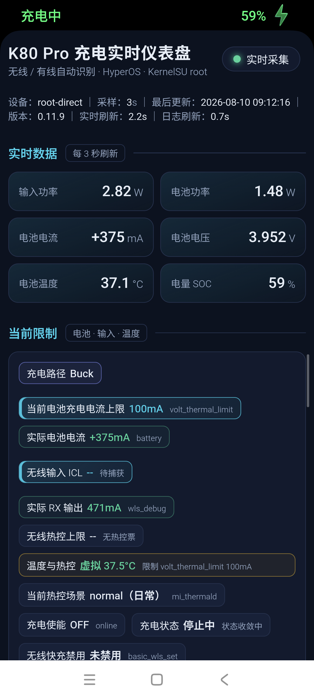

# 充电实时仪表盘（Android）

直接在 Redmi K80 Pro（miro）及同类 MIUI/HyperOS root 机型上读取 sysfs、MCA 日志和 mi_thermald 状态的充电仪表盘。应用使用原生 WebView 展示，不需要 ADB、电脑或网络权限。

当前版本：**v0.11.25（versionCode 72）**。

## v0.11.25 重点改进

- 有线 CP 的“当前电池充电上限”现在优先采用同一会话 Quick Charge `mca_quick_charge_select_max_ibat` 的最终 `cur_max`；该值已包含 `delta_cur` 修正。
- 若最终行暂时未捕获，才使用同一阶段的 `cur_max - delta_cur` 推算；再与当前分压 MONITOR-BAT 和 SIC-BAT 上限取最小值。决策日志陈旧或缺失时显示“Quick Charge Final 待捕获”，不再把旧的 22A 热控票当成当前最终上限。

## v0.11.22 重点改进

- 修正同名 `xm_wls` 的解释：其语义由所在 votable 决定，`wireless_sw_qc_ich` 中的票属于无线 CP 软件电池电流限制。
- 无线 Buck 隐藏 `wireless_sw_qc_ich/wireless_sw_thermal_ich/wls_single/multi_chg_cur`；无线 CP 保留这些 CP 票并隐藏 Buck 票。

## v0.11.21 重点改进

- 按有线 CP、有线 Buck、无线 CP、无线 Buck 四路硬隔离当前限制和投票详情，禁止跨路径旧票混入。
- 无线 CP 隐藏 `wireless_buck_input`/`buck_charge_curr`；无线 Buck 隐藏 Quick Wireless CP 决策，并过滤 CP 残留 `wireless_qc` 票。
- 正向确认 `xm_wls/wls_icl` 属于 Buck/PMIC 无线输入支路，`buck_charge_curr` 的执行回调属于 Buck ICHG；修正旧文档中的能力票、下降量等错误解释。

## v0.11.20 重点改进

- 会话档案同时识别无线 `power_good_on/off` 和有线 `USB ONLINE=1/0` 边界；有线充电不再沿用旧无线会话。
- 断开后立即封口当前会话，连续“设置充电电流”合并为首值→末值和次数，避免会话卡无限变长。
- 会话卡明确标注来源（有线/无线），并覆盖有线 HVDCP/PD 等新会话。

Web / ADB 版见 [charging-live-dashboard](https://github.com/leowood2000/charging-live-dashboard)。两版的数据语义保持一致。

## v0.11.19 重点改进

- 有线 CP/Buck 的首页电池上限合并 MONITOR-BAT 路径票与 SIC-BAT `wired_chg_curr`，显示为有线热控上限，不再把单一分压票误称为完整上限。
- `buck_charge_curr` 作为有线 Buck/无线 Buck 共用 topic 增加会话时间归属检查，切换输入源时宁可显示“待捕获”，也不复用另一支路的旧 FCC。
- “温度与热控”摘要改为仅从当前输入源/功率路径取证；Android 前端以 `input_source` 为准，不再受残留 `wired_online` 覆盖。

## v0.11.18 重点改进

- 投票日志改为按 topic 增量合并，某个低频 topic 滑出日志窗口时不再让有线/无线限制值瞬间消失。
- 无线会话边界会清理旧无线票；有线断开边界会清理旧有线票，避免跨会话残留。
- 新增独立 `derived.wireless_path`，无线 CP/Buck 路径、比例、Quick Wireless Final、ICL 和 RX 上限不再依赖 `wireless_buck_input` topic 是否仍在当前日志窗口。

## v0.11.17 重点改进

- 修复有线充满停充后仍显示 `5mA · CP ibus_total` 的语义问题：CP 总线近空闲且 `chg_enable=OFF`、电池电流接近 0 时，输入主测量切换为 USB `CURRENT_NOW`。
- 页面同时显示“外部系统输入”和独立“CP支路电流”，明确区分手机系统耗电与电池充电电流。
- 正常 CP 充电或停充但 CP 仍有明显电流时，继续保留 `CP ibus_total` 为主输入。

## v0.11.16 重点改进

- Android 温度与热控卡片改为与 Web 一致的紧凑布局，充电时不再强制占满整行。
- 新增 `wireless_connected` 会话锁存：`power_good_on/off` 决定充电板连接，低 RX 电流只影响 `input_source`，不再让停充旁路的当前限制卡反复消失。
- 新增连接状态回归测试，覆盖低电流旁路、断开后残留 vout 和未知状态回退。

## v0.11.15 重点改进

- 修复有线 CP 切换无线 CP 后偶发显示旧有线 `CP 1:1`：`USB ONLINE=0` 现在硬否决有线，残留 VBUS 不再把页面锁进有线分支。
- 输入源判定改为 USB ONLINE 三态规则；仅 ONLINE 未知时允许 VBUS 回退，USB 在线且无线也有信号时仍以有线为准。
- `ibus_total` 只在输入源确定后解释为当前 CP 总线数据，不再反向证明有线存在；新增 5 个固定回归测试。

## v0.11.14 重点改进

### 更低的应用自身功耗

- App 仅在前台采集；进入后台或锁屏时暂停 root 读取、WebView 和 JavaScript 定时器，回到前台再立即刷新。
- 快速数据每 3 秒采集一次；MCA 日志在连接/充电时约 10 秒、完全断开时约 60 秒采集一次。
- 每轮 sysfs/battery/thermal 合并为一次 root 命令；投票、会话和功率路径日志也合并为一次 root 命令。
- root 命令串行执行，避免多个 `su`、`tail`、`grep` 同时抢占 CPU；首次 `onResume` 不再重复触发一轮立即采集。
- session/event 最多读取最近两个轮转文件，只解析并保留最新一个会话；功率路径使用最新一个文件的 1 MiB 窗口。
- 使用 `grep -F -e` 固定字符串白名单和手机端 `tail` 截断，降低日志扫描、传输和 Java 解析成本。
- 已移除不需要的 `INTERNET` 权限。

> Android App 前台与 Web 页面同时显示时，两套采集器会分别执行 root/sysfs/日志读取，CPU 唤醒会叠加。实机 20 秒短测中，Android 单独前台约 13.97% 总忙碌率，同时开启 Web 活跃采集约 14.91%（仅作方向性参考）。做功耗测试时只保留一个前台界面：看 Web 时把 Android App 置于后台；看 Android 时关闭 Web 页面或停止服务。

### 更紧凑、层次更清楚的界面

- 实时数据压缩为输入功率、电池功率、电池电流、电池电压、电池温度和 SOC。
- “当前限制”固定顺序：充电路径最先；当前电池充电电流上限与实际电池电流组成一组；无线 CP 显示 RX 允许上限与实际 RX，无线 Buck/旁路显示 Buck 输入 ICL 与实际 RX；温度、场景和使能状态随后展示。
- 电池上限尚未捕获时保留 `-- / 待捕获`，避免数据缺失时整项消失。
- 私有快充、无线策略、有线策略和实时会话档案默认折叠。
- 四条曲线依次为：电池电流、输入电流、输入电压、输入功率。
- 电流投票只优先展示生效主题和生效票，未生效票收进折叠区；顺序优先体现电池充电限制与无线输入限制。

### 已校正的数据语义

- 实时数据中的“电池温度”是电芯实体温度；“当前限制”中的绿色“虚拟温度”是 mi_thermald 的主要温控决策温度，并与当前热控场景放在一起。
- 无线路径改为实时 `mca_platform_cp/ibus_total` 与当前会话 `operation mode/work_mode` 融合判定：`≥100mA` 为 CP、`20–100mA` 为切换中；`≤20mA` 只有在没有当前会话 CP 证据时才判 Buck，既不把预启动 3–5mA 当成 CP，也不会因 CP 稳态瞬时读到 0 而误判 Buck。
- mi_thermald 仍只读取 64KB 尾部，但单次提取“最新无线行 + 最新通用虚拟温度行”并缓存最后有效值；空闲启动无需先充电即可显示虚拟温度和热控场景。
- 会话档案把连续的 `open path ibus` 电流爬升合并成一条“CP 建链”，保留首末电流和次数，不再误导为反复开关快充路径。
- 输入仍连接但已自动停充时，路径从“停止中”稳定收敛到“已停止”，当前上限不再回显旧 CP/Buck 目标；`USB ONLINE=0` 明确否决有线，只有 ONLINE 未知时才允许 VBUS 回退，拔线后不会被缓存日志重新判成有线。
- 日志年龄采用事件真实时间，并正确处理单个日志文件跨午夜；重启采集器不会把旧决策误标成“刚刚”。
- 当前电池充电电流上限按来源与路径取值：无线 CP 使用手机原生 Quick Wireless `cur_max:[Final]`；有线 CP 优先使用同一会话 Quick Charge `mca_quick_charge_select_max_ibat` 的最终 `cur_max`（必要时用阶段 `cur_max-delta_cur` 回退），再与当前 MONITOR-BAT 路径票和 SIC-BAT `wired_chg_curr` 的动态上限取较小值；有线 Buck 仍取当前 `buck_charge_curr` 与 SIC-BAT 的较小值。算法日志陈旧或缺失时显示“Quick Charge Final 待捕获”，不把旧热控票冒充最终值。
- 从有线切换到无线时，实时输入源优先于残留 USB ONLINE/有线 CP 日志，避免无线慢充沿用上一段有线 CP 路径。
- 无线 CP 总览显示 `RX 输出允许上限` 与 `实际 RX 输出` 两行；两行分别使用与电池上限/实际电流相同的主次高亮颜色。
- 无线停充但仍在旁路供电时，显示 `无线 Buck ICL（旁路）`；电池充电上限显示为 `-- / 已停止`。
- 无线 Buck/旁路输入 ICL 取 `wireless_buck_input effective`，经 `strategy_wireless_set_input_curr_limit` 下发 Buck/PMIC 无线输入支路；无线 CP 的 RX 允许上限取当前会话 `rx_iout_limit`，实际 RX 输出取 `wls_debug iout`。CP 页面不显示 Buck 输入票，Buck 页面不显示 Quick Wireless CP 决策。
- `wireless_qc=100` 是 Quick Wireless 在 CP 生命周期内投给 `wireless_buck_input` 的绝对 100mA 票，用于压低并行 Buck/PMIC 支路；它不是“降低 100mA”，也不是 CP/RX 主链路输入上限。CP 停止时驱动会在关闭 CP 后撤销该票。
- 客户端名 `xm_wls` 会被复用于不同 votable，必须连 topic 一起解释：`xm_wls @ wireless_buck_input` 是 Buck 输入 ICL 票；`xm_wls @ buck_charge_curr` 是 Buck FCC 票；`xm_wls @ wireless_sw_qc_ich` 是无线 CP 的 `sw_qc_ichg` 软件电池电流票，参与 Quick Wireless `select_max_ibat`。同名不代表同一限制层。
- `rx_iout_limit` 是无线 CP 路径的 RX 输出策略允许上限；`tx_adapter_max` 是 TX 适配器能力换算后的 Quick Wireless 电池侧 ceiling。手机侧没有解析到可直接显示为“TX 线圈电流上限”的统一字段。
- `buck_charge_curr` 由 `mca_strategy_buckchg` 创建，仲裁回调 `strategy_buckchg_charge_limit` 最终调用 `platform_class_buckchg_ops_set_ichg`，确定属于 Buck 充电器电池侧电流限制。无线基础模块与有线 JEITA/Buck 策略会向同一个全局 votable 投票，但 CP 活跃时不把它作为当前 CP 电池上限。
- 有线/无线与 Buck/CP 按四路过滤：有线 CP 只显示当前 `div1/div2/div4` 与 CP 实测，有线 Buck 只显示 `buck_input/buck_charge_curr` 和当前 5V/9V 档，无线 CP 只显示 Quick Wireless、`wireless_sw_qc_ich/wireless_sw_thermal_ich/wls_single/multi_chg_cur` 与 RX 限制，无线 Buck 只显示 `wireless_buck_input/buck_charge_curr`。

## 截图



## 安装

1. 从 [Releases](https://github.com/leowood2000/charging-live-dashboard-android/releases) 下载最新版 APK。
2. 安装并打开应用。
3. 在 KernelSU / Magisk 中授予 root 权限。

应用启动后自动开始采集。没有 root 权限或数据读取失败时，页面会显示占位符/错误状态，不生成模拟数据。

## 从源码构建

要求：JDK 17、Android SDK 34、Gradle。

```sh
gradle assembleDebug
```

默认产物：`app/build/outputs/apk/debug/app-debug.apk`。

## 主要数据来源

- `/sys/devices/platform/soc/soc:mca_*`：充电框架 sysfs
- `/sys/class/power_supply/battery/uevent`：电池状态、实体温度、电流和电压
- `/data/vendor/bsplog/charge/charge_logger/mca_log/`：MCA 投票、会话和功率路径日志
- `/data/vendor/thermal/thermal.dump`：虚拟温度、场景和热控等级

## 关键实现文件

- `SnapshotCollector.java`：采集、日志窗口、投票/会话解析、路径判定、缓存和 JSON 快照
- `RootShell.java`：root 探测、串行命令执行、超时和输出消费
- `MainActivity.java`：前后台生命周期、快慢采集调度和 WebView bridge
- `app/src/main/assets/index.html`：仪表盘 UI
- `MAINTENANCE_NOTES.md`：跨会话维护总结、已确认语义、踩坑记录和发布检查表

## 发布包校验

Release 同时提供 APK 与 `SHA256SUMS.txt`。安装前可对 APK 计算 SHA-256，并与校验文件比对。
