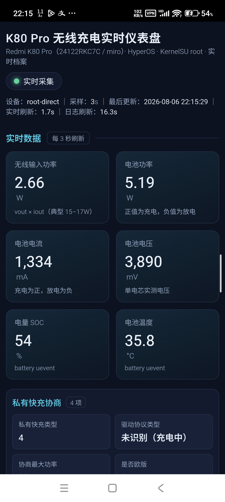
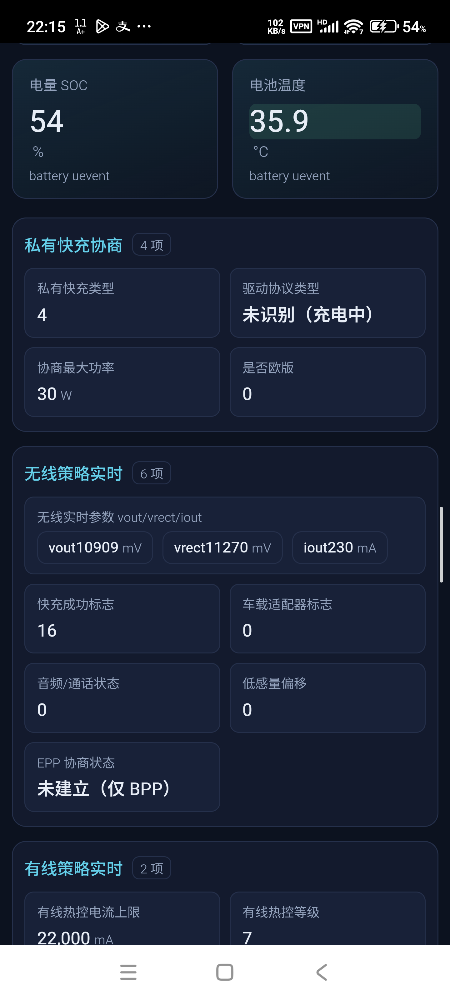
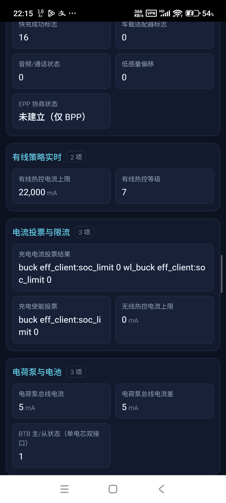
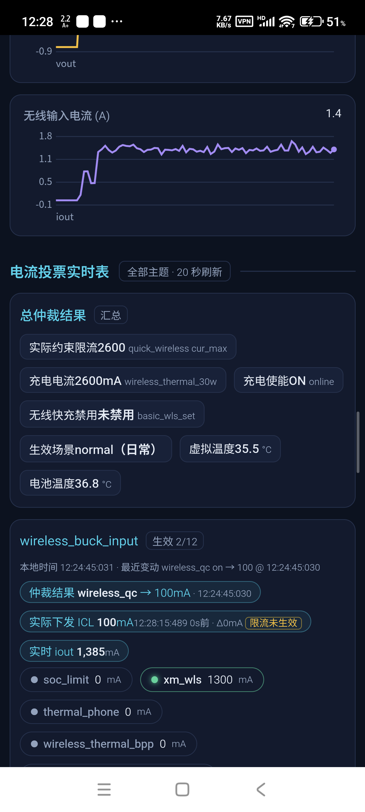

# 充电实时仪表盘（Android）

K80 Pro（及同类 MIUI/HyperOS root 机型）无线/有线充电实时仪表盘 APK。

直接在手机上通过 root（KernelSU / Magisk）读取 sysfs、MCA 内核日志与 mi_thermald 状态，
**不需要 ADB、不需要电脑**。页面为 WebView 内嵌仪表盘，首页即展示实时 KPI 与**投票总仲裁结果**。

## 截图

| 首页实时 KPI | 无线/有线策略实时 | 投票与限流 | 总仲裁结果 |
|---|---|---|---|
|  |  |  |  |

截图为 K80 Pro（miro）实机画面：首页 KPI、私有快充协商、无线/有线策略实时、MCA 投票与总仲裁结果（仲裁值 / 实际下发 ICL / 实时 iout 同屏对照）。

## 功能

- 实时 KPI：无线输入功率、电池充电功率/电流/电压、SOC、电池温度
- 电流符号统一：充电为正、放电为负，电池功率正负同理
- 私有快充协商（quick_charge_type / power_max / EPP 协商状态）
- 无线/有线热控实时数据（无线热控限流、有线热控等级、热控档位投票）
- 电流投票实时表 + **总仲裁结果**（生效客户、最终值、推算值）
- MCA 仲裁展示修正：驱动 `effective vote is now` 优先，`wireless loop: icl` 单独显示为“实际下发 ICL”，不再混为一谈
- 每个 votable 标注已核实的仲裁类型（MIN/MAX/NONZERO/ZERO），未知类型不做盲目推算
- 投票解析支持 `voting on/off`，并按主题分别缓存最近变动与结果，避免日志交错串线
- 投票区只显示**生效主题**（有启用票或驱动已给出实际结果）
- `wireless_auth_*`（20w/30w/50w/80w/voice_box/magnet）与 `wireless_bpp/bppqc2/bppqc3/epp_in` 是按充电板型号/协议模式预置的热控表，无论连接哪台垫都会被整批投票，已直接隐藏
- `term_volt` / `term_curr`（JEITA 终止电压/电流）合并为一张“JEITA 终止参数”卡并标注**静态常数**（由温度档决定，会话内基本不变）
- 有线/无线快充禁用卡按当前连接动态显示（无线充电只显示无线侧，有线充电只显示有线侧）
- 仲裁结果带**有效性校验**：主题全部撤票（如拔掉充电）后，旧 `effective vote is now` 不再展示，卡片按“生效主题”隐藏，避免拔电后仍挂着旧限流值
- 功率路径判定只以 sc8581 电荷泵 work_mode 为准（不用电流大小猜测）：首页显示“当前功率路径”（电荷泵 / Buck 直充）
- “当前功率路径”chip 附带电荷泵转换比（由 quick wireless work_mode 映射：1:1 bypass / 2:1 div2 / 4:1 div4）
- 未充电（battery STATUS ≠ Charging）时隐藏全部投票/仲裁卡片，仅保留生效场景、虚拟温度、电池温度与 JEITA 静态参数，避免“没充电还挂着一堆票”
- 电荷泵路径生效时，首页隐藏 `wireless_buck_input`，折叠到“仲裁详情 · 未生效”卡（保留名义仲裁与投票，标注退出 CP 后将使用该限流）
- 总仲裁“无线输入限流”优先显示驱动实际下发的 `wireless loop: icl`（证据链 soc_limit → effective → icl），仅在实际输入电流明显违反时标注“未生效”
- 电池侧 cur_max / buck_fcc 单独显示为“电池侧充电上限”，与输入侧 ICL 分开展示，不再互相覆盖
- ICL 带日志时间与采集时刻，`power_good_off` 后自动清零，旧会话残留一目了然
- 总仲裁只显示实际结果：无线输入限流在仲裁值未生效时，chip 改为“实际约束限流”并显示电池侧真正约束电流的限流（quick_wireless cur_max / buck_fcc），不再误标为无线输入电流；保留生效场景 / 虚拟温度 / 电池温度
- 实际下发 ICL / 实时 iout / 限流未生效细节移到 wireless_buck_input 详情卡，并按物理功率比（icl × vrect / vbat）判定
- 热控电流上限（wired/wireless_chg_curr）按 µA → mA 换算并标注“策略上限”，不再把原始值当 mA 显示
- 电池 INPUT_CURRENT_LIMIT 按 µA→mA、TIME_TO_FULL_NOW 按秒→分钟换算
- 移动端电池标准属性恢复两列，长字段（型号/类型）跨两列
- 会话档案只保留最近 3 个
- real_type=Unknown 状态化显示（放电=未连接，充电=未识别）
- 投票未知主题不再默认 mA 单位；effective/投票表行 client 正则与 voting 行统一
- 实时会话档案（插拔 / 私有认证 / 快充协商 / SmartEndura 介入）
- 实时曲线（输入功率、电池电流、vout、iout）
- 虚拟温度与生效场景（来自 mi_thermald thermal.dump）
- 双周期采集：实时数据 3 秒、日志数据 10 秒，顶部有独立倒计时
- 日志读取失败时保留上次成功数据并显示"日志读取失败"提示

## 安装

1. 在 Releases 或 Actions Artifacts 下载 `app-debug.apk`
2. 安装后打开，首次会检测 root 权限（KernelSU / Magisk 的 su）
3. 授予 root 后自动开始 3 秒刷新采集

## 从源码构建

```sh
gradle assembleDebug
```

产物：`app/build/outputs/apk/debug/app-debug.apk`

## 仲裁展示说明

首页“总仲裁结果”里的 **无线输入限流** 表示 MCA 驱动的逻辑仲裁结果（来源为内核日志
`effective vote is now ...`）；**实际下发 ICL** 表示 `wireless loop: icl:` 打印的、
经过协议/硬件/保护逻辑处理后的真实下发值。两者含义不同，页面会同时展示并给出差值。

投票类型来自对 miro 固件 `mca_*.ko` 的反汇编核实，而非按单位猜测：

| 类型 | 含义 | 已核实的 votable 示例 |
|---|---|---|
| MIN | 启用票中取最小 | wireless_buck_input、buck_charge_curr、wireless_*_in、wireless_sw_*_ich、wls_single/multi_chg_cur、div*、single/multi_chg_cur |
| FIRST_NONZERO | 首个启用且非零的投票 | quick_chg_disable、wls_quick_chg_disable |
| FIRST_ZERO | 首个启用且为零的投票 | quick_chg_en |
| UNKNOWN | 未核实，不做推算，单位也不猜测 | 其余主题 |

## 数据来源（设备内，无需 ADB）

- `/sys/devices/platform/soc/soc:mca_*` 充电框架 sysfs
- `/sys/class/power_supply/battery/uevent` 电池标准属性
- `/data/vendor/bsplog/charge/charge_logger/mca_log` MCA 日志（投票/会话/EPP）
- `/data/vendor/thermal/thermal.dump` mi_thermald 实时状态（虚拟温度/场景/等级）

## 相关仓库

- [charging-live-dashboard](https://github.com/leowood2000/charging-live-dashboard) — Web 版（ADB 采集）
- [charging-thermal-database](https://github.com/leowood2000/charging-thermal-database) — 热控数据库
